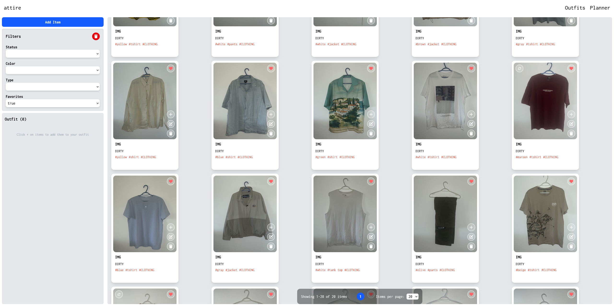
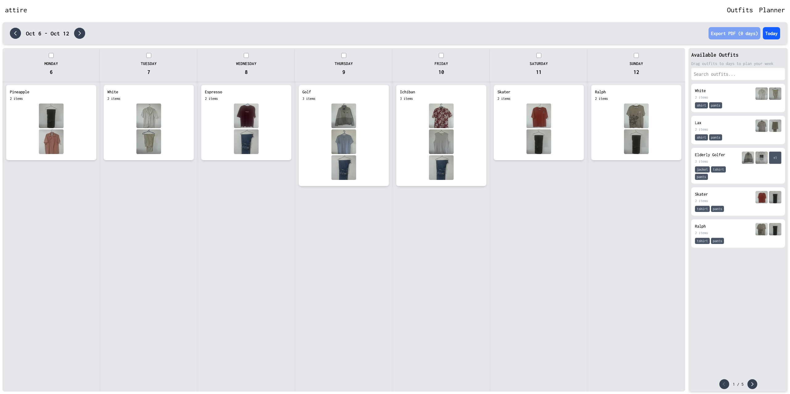

# attire

A modern application to organize, plan, and manage your wardrobe.

---

## Table of Contents

1. Overview
2. Quick Start (Production)
3. Development Workflow
4. Core Features
5. Services (Architecture)
6. Persistent Data & Volumes
7. Volume Management (Backup / Inspect)
8. Troubleshooting & Common Tasks
9. Environment Variables
10. File Structure
11. Bulk Import CLI
12. Upcoming (Preview)
13. Contributing / Feedback

---

## 1. Overview

Attire helps you digitize your wardrobe, build outfits, and plan what to wear
using a calendar-based planner. The stack is:

-   Frontend: React + TypeScript + Vite (hot reload in dev, Nginx in prod)
-   Backend: Node.js + Express + TypeScript
-   Database: SQLite (via better-sqlite3) stored on a Docker volume
-   Storage: Local volume for uploaded item images (front/back)

All runtime & persistence can be managed with Docker Compose.

---

## 2. Quick Start (Production)

Prerequisites: Docker & Docker Compose.

Build and start (first run builds images):

```sh
docker compose up -d --build
```

Access:

-   Frontend: http://localhost:3000
-   Backend API (direct): http://localhost:3001

Stop services:

```sh
docker compose down
```

Remove everything including named volumes (WARNING: deletes data):

```sh
docker compose down -v
```

---

## 3. Development Workflow

Use the dev overrides for hot reload (Vite + ts-node / nodemon style tooling):

```sh
docker compose -f docker-compose.yml -f docker-compose.dev.yml up --build
```

Dev URLs:

-   Frontend (Vite): http://localhost:5173
-   Backend (API): http://localhost:3001

Run detached:

```sh
docker compose -f docker-compose.yml -f docker-compose.dev.yml up -d --build
```

View logs (all or per service):

```sh
docker compose logs -f
docker compose logs -f frontend
docker compose logs -f server
```

Rebuild without cache:

```sh
docker compose build --no-cache
docker compose up -d
```

Shell into containers:

```sh
docker compose exec server sh
docker compose exec frontend sh
```

Check status:

```sh
docker compose ps
```

---

## 4. Core Features

### Inventory Management

-   Add / remove clothing items
-   Filter + full‑text search
-   Front / back image support (optional back image)
-   Tag, categorize, favorite items



### Outfit Creation

-   Build & save outfits
-   Maintain a reusable outfit library
-   Combine items for occasions & seasons

### Outfit Planning

-   Calendar-based daily planner
-   Drag & drop scheduling
-   Search outfits by name or attributes



---

## 5. Services (Architecture)

### Frontend

-   Production: Static build served by Nginx (port 3000)
-   Development: Vite dev server with HMR (port 5173)

### Backend

-   Express + TypeScript (port 3001)
-   Provides REST API, file uploads, and database migrations

### Database

-   SQLite file(s) persisted to a named Docker volume

### Networking

-   Docker Compose network lets frontend call backend at its internal service
    name (usually `server`), while local dev uses `http://localhost:3001`.

---

## 6. Persistent Data & Volumes

Data that persists across container recreation:

-   Database: `/app/data` (SQLite files)
-   Uploads: `/app/uploads` (item images)

These are mapped to named volumes declared in `docker-compose.yml`.

---

## 7. Volume Management (Backup / Inspect)

List volumes:

```sh
docker volume ls
```

Inspect (names may be prefixed by the Compose project, e.g.
`attire_attire-data`):

```sh
docker volume inspect attire_attire-data
docker volume inspect attire_attire-uploads
```

Backup database volume:

```sh
docker run --rm -v attire_attire-data:/data -v $(pwd):/backup alpine tar czf /backup/database-backup.tar.gz -C /data .
```

Backup uploads volume:

```sh
docker run --rm -v attire_attire-uploads:/uploads -v $(pwd):/backup alpine tar czf /backup/uploads-backup.tar.gz -C /uploads .
```

Restore example (choose correct target volume):

```sh
docker run --rm -v attire_attire-data:/data -v $(pwd):/backup alpine sh -c "tar xzf /backup/database-backup.tar.gz -C /data"
```

---

## 8. Troubleshooting & Common Tasks

Rebuild everything fresh:

```sh
docker compose down --rmi all
docker compose up --build
```

Remove ALL (containers + volumes + images) and start over (destructive):

```sh
docker compose down -v --rmi all
docker compose up --build
```

Verify containers running:

```sh
docker compose ps
```

See real-time logs:

```sh
docker compose logs -f server
```

Check disk usage for clarity:

```sh
docker system df
```

Prune dangling images (safe if you know no other stacks rely on them):

```sh
docker image prune -f
```

---

## 9. Environment Variables

### Frontend (`frontend/.env`)

```
VITE_API_URL=http://localhost:3001
```

Adjust to deployed backend URL in production deployments behind reverse proxy.

### Server (defined in `docker-compose.yml`)

-   `NODE_ENV` (production | development)
-   `PORT` (default 3001)

Add any future secrets via environment variables or a secret manager (avoid
hard‑coding in images).

---

## 10. File Structure (Top-Level Extract)

```
├── docker-compose.yml            # Production Compose
├── docker-compose.dev.yml        # Dev overrides (hot reload)
├── frontend/
│   ├── Dockerfile                # Frontend container
│   ├── nginx.conf                # Nginx for static build
│   └── src/                      # React + TS source
└── server/
	├── Dockerfile                # Backend container
	├── src/                      # Express + services + migrations
	├── data/                     # (Volume) SQLite files
	└── uploads/                  # (Volume) Uploaded images
```

---

## 11. Bulk Import CLI

Bulk import lets you ingest a folder of local clothing photos into the inventory
in one go. It copies images into the uploads volume and creates inventory rows.

Script location: `server/src/bulk-import.ts` (invoked via npm script).

### 11.1 Running Locally (Dev Containers Up)

From the `server` directory (or project root with path adjusted) using ts-node:

```sh
cd server
npm run bulk-import -- --source "C:\\Path\\To\\Clothes" --tags "summer,casual" --status washed
```

Preview (no changes made):

```sh
npm run bulk-import -- --source "C:\\Path\\To\\Clothes" --dry-run
```

### 11.2 Arguments

```
--source, -s <dir>      (Required) Directory containing images
--tags, -t <tags>       Comma-separated tags (default: clothing)
--status <status>       dirty | washed | ironed (default: dirty)
--dry-run               Show what would happen without importing
--no-title-generation   Use generic title instead of filename-based title
--help, -h              Show help
```

Images with extensions: .jpg .jpeg .png .gif .bmp .webp are accepted.

Title generation removes long numeric sequences (timestamps), replaces dashes /
underscores with spaces, and capitalizes words.

### 11.3 Running Inside Docker (Production Container)

1. Mount the host directory with images into the server container by adding a
   bind mount to the `server` service in `docker-compose.yml` (example):
    ```yaml
    services:
      server:
    	 volumes:
    		- attire-data:/app/data
    		- attire-uploads:/app/uploads
    		- C:/Path/To/Clothes:/app/import-source:ro
    ```
2. Recreate / start containers:
    ```sh
    docker compose up -d --build
    ```
3. Execute the bulk import script in the running container:
    ```sh
    docker compose exec server npx ts-node src/bulk-import.ts --source /app/import-source --tags "casual,shirts" --status washed
    ```

Dry run inside container:

```sh
docker compose exec server npx ts-node src/bulk-import.ts --source /app/import-source --dry-run
```

### 11.4 Notes

-   Back images aren't added during bulk import (only front image populated).
-   All imported items default to color "unknown" and type "clothing" (can be
    edited later through the app / API).
-   Files are copied into `/app/uploads` with a generated unique filename.
-   If a filename cleans to fewer than 3 characters, a generic title is used.
-   Use `--no-title-generation` to keep generic titles for every item.

### 11.5 Common Examples

```sh
# Import with multiple tags
npm run bulk-import -- --source "C:\\Wardrobe\2025-Spring" --tags "spring,layering,outerwear" --status ironed

# Skip title generation
npm run bulk-import -- --source "C:\\Wardrobe\ToSort" --no-title-generation

# Container dry run
docker compose exec server npx ts-node src/bulk-import.ts --source /app/import-source --dry-run --tags "bulk" --status dirty
```

---

## 12. Upcoming (Preview)

-   Bulk Import UI
-   Bulk Export UI
-   Advanced outfit search & filtering
-   Tag-based filtering everywhere
-   Cloud deployment
-   User profiles
-   Statistics

---

## 13. Contributing / Feedback

Issues, ideas, and PRs are welcome. Feel free to open a discussion for feature
proposals or architectural suggestions.

---

Happy organizing!

## 👨‍💻 About Me

✨ **Mitravasu Prakash**

🌐 [mitravasu.com](https://www.mitravasu.com/)

[](https://www.mitravasu.com/)
